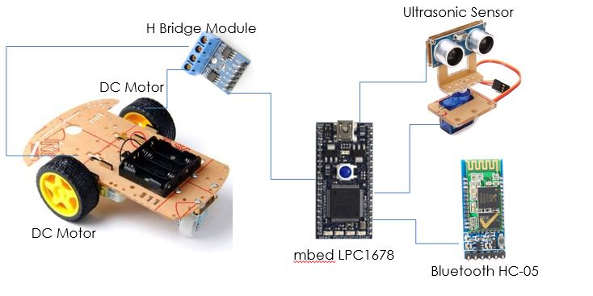
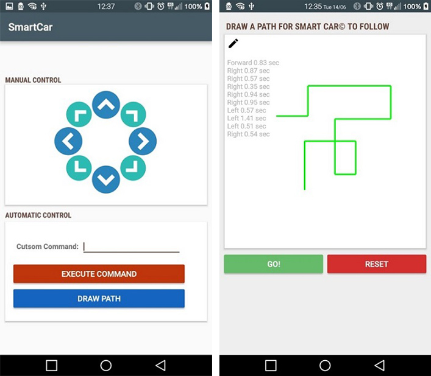

# SmartCar
A remote controlled robot vehicle project, using a mbed LPC1678 microcontroller, and Bluetooth communication.  
The system was created using the ARM mbed Enviroment, using C/C++, and the official RTOS library.

  

## Features
* Remote controlled by any Android Smartphone using Bluetooth.  
* Manual Control - Using the arrows (as shown in the screenshot).  
* Automatic Control - Robot follows a drawn path, distance traveled is decided by the length of each line. 
* Recognition of obstacles by sampling the UltraSonic sensor (proximity sensor), and avoiding them.  
* User friendly application interface.  

## System Components

## Android Application

